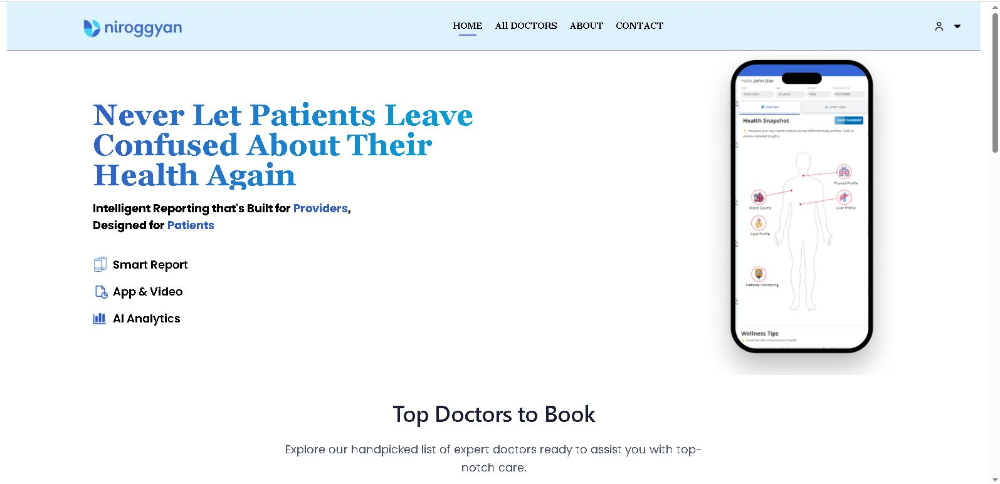
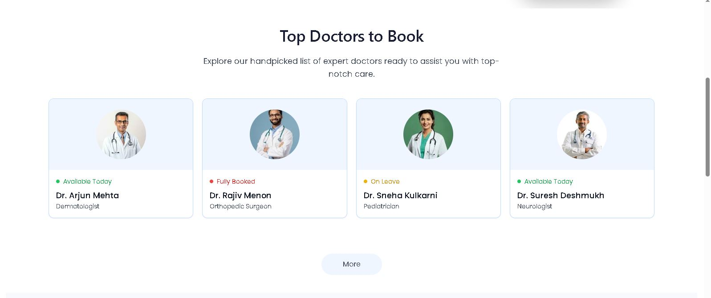
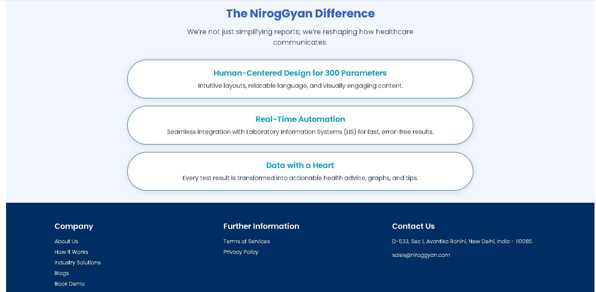
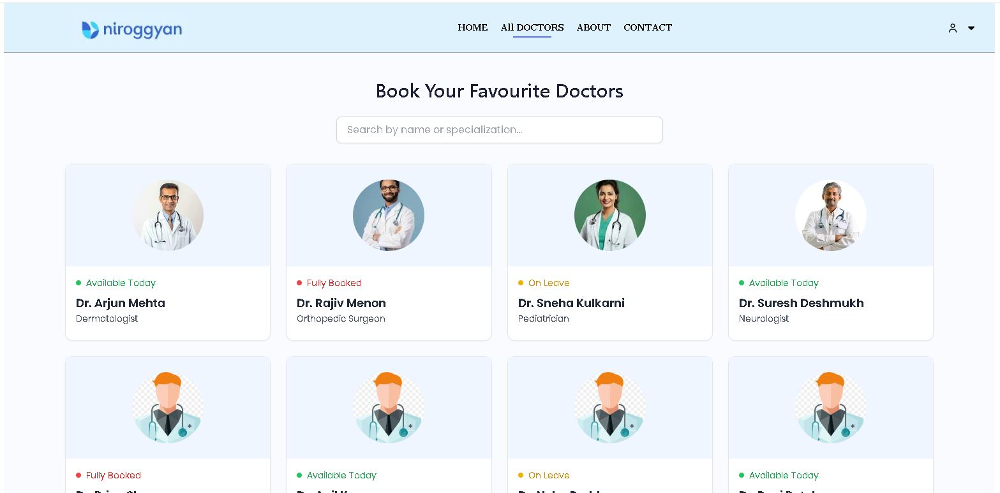
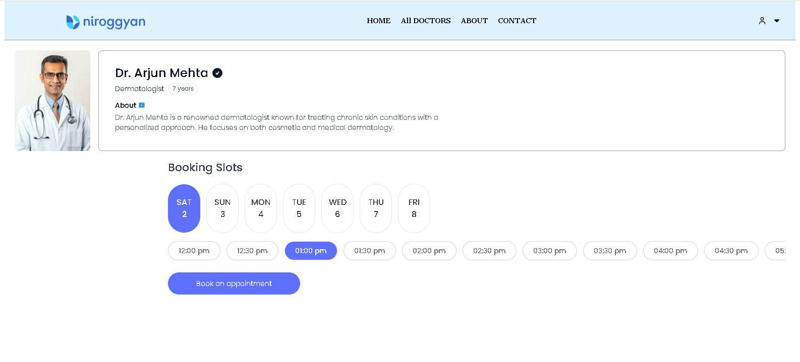
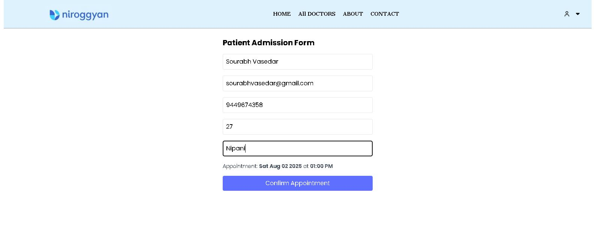
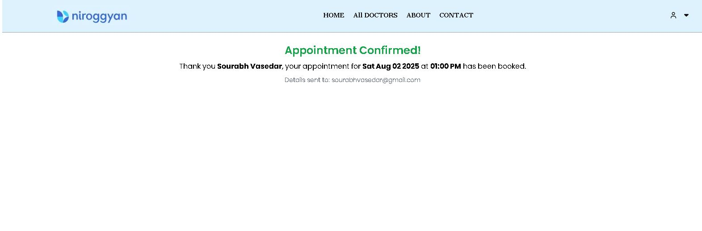

# React + Vite

This template provides a minimal setup to get React working in Vite with HMR and some ESLint rules.

Currently, two official plugins are available:

- [@vitejs/plugin-react](https://github.com/vitejs/vite-plugin-react/blob/main/packages/plugin-react) uses [Babel](https://babeljs.io/) for Fast Refresh
- [@vitejs/plugin-react-swc](https://github.com/vitejs/vite-plugin-react/blob/main/packages/plugin-react-swc) uses [SWC](https://swc.rs/) for Fast Refresh

## Expanding the ESLint configuration

If you are developing a production application, we recommend using TypeScript with type-aware lint rules enabled. Check out the [TS template](https://github.com/vitejs/vite/tree/main/packages/create-vite/template-react-ts) for information on how to integrate TypeScript and [`typescript-eslint`](https://typescript-eslint.io) in your project.

# 🏥 Healthcare Appointment Booking System

A responsive web application that allows patients to browse doctors, view available appointment slots, and book an appointment seamlessly. Built using modern front-end technologies with a focus on clean UI and efficient state management.

---

## 🚀 Features

- 🧑‍⚕️ Doctor listing with image and specialization
- 📆 Real-time appointment slot display
- 🕒 Slot selection by day and time
- 📝 Patient admission form with details like Name, Email, Mobile, Age, City
- ✅ Booking confirmation screen with details
- 🌐 Fully responsive design for mobile and desktop

---

## 🛠️ Tech Stack Used

### 💻 Frontend:
- **React.js** – UI development and component-based architecture
- **Tailwind CSS** – For fast and responsive styling
- **React Router** – Navigation between pages
- **Context API** – Global state management for slots, doctors, etc.
- **JavaScript (ES6+)** – Core logic and event handling

---

## 📌 Future Enhancements

- 🔐 Authentication for patients and doctors
- 📊 Dashboard for doctors to manage bookings
- 📅 Integration with calendar APIs
- 🧾 PDF confirmation or reminders via notifications
- 
### Home Page

